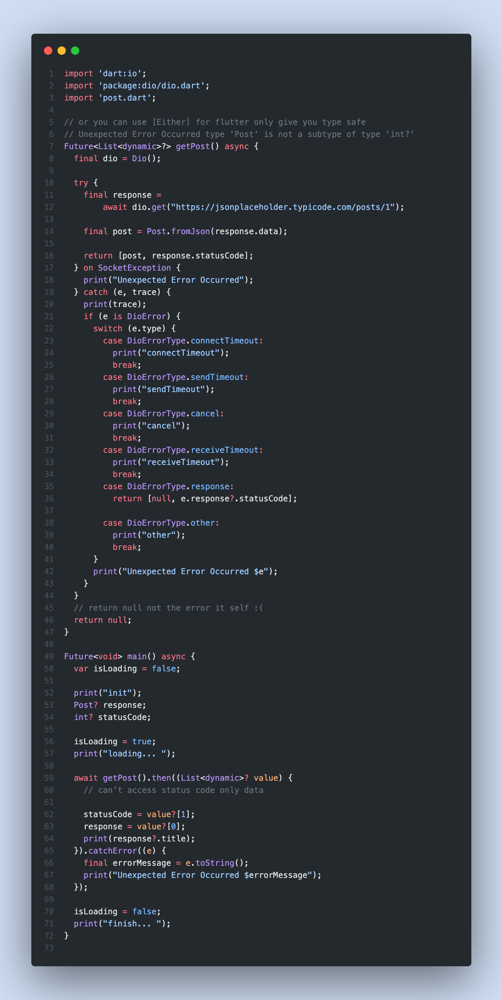
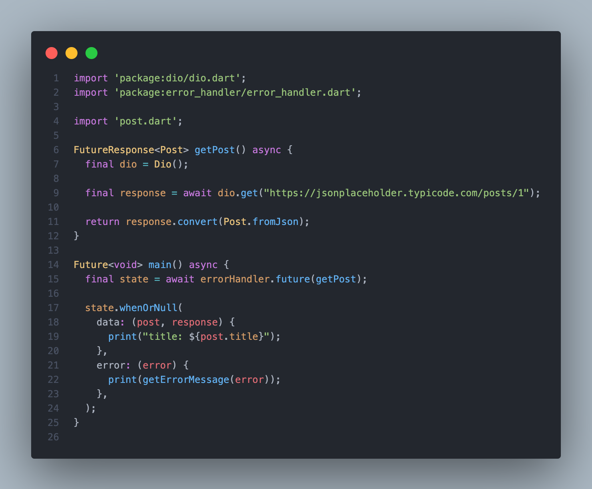

Welcome to [ErrorHandler](https://pub.dev/packages/error_handler), error handler with type-safety/streaming/freezed-functionality/cover-all-clients-exceptions


## Index
- [Motivation](#motivation)
- [Functionality](#functionality)
- [How to use](#how-to-use)
  - [install](#install)
  - [Example](#example)
    - [```.stream``` provide Loading and Idle State full example](#stream-provide-loading-and-idle-state-full-example)
    - [Advance login example for post request full example](#advance-login-example-for-post-request-full-example)
  - [Contribute](#contribute)
  - [Credits 🙏](#credits-)

# Motivation
```try{}catch(e){}``` or ```then((){}).catch((){})``` make code hard to read and modify

# Functionality
- handle all api possible state init/loading/data/error easily
- logging the state states
- built above [freezed](https://github.com/rrousselGit/freezed)
- **work with any http client like [chopper](https://pub.dev/packages/chopper),[dio](https://pub.dev/packages/chopper) and more **

<!-- | Before                          | After                          |
| ------------------------------- | ------------------------------ |
|  |  | -->


# How to use
## install

For a Flutter project:

```shell
flutter pub add error_handler
flutter pub add dio
```

For a Dart project:

```shell
flutter pub add error_handler
flutter pub add dio
```

## Example
- ```.future``` get api result directly [full example](example/error_handler.dart)
```dart
import 'package:dio/dio.dart';
import 'package:error_handler/error_handler.dart';

FutureResponse<Post> getPost() async {
  const path = "https://jsonplaceholder.typicode.com/posts/1";
  final response = await Dio().get(path);
  return response.convert(Post.fromJson);
}

/// wrap the api call with [ErrorHandler.future]
Future<void> main() async {
  final state = await ErrorHandler().future(getPost);

  state.whenOrNull(
    data: (post, response) {
      print("title: ${post.title}");
    },
    error: (error) {
      print(getErrorMessage(error));
    },
  );
}
```
  - ```errorHandler.future((){...})``` return safe data


### ```.stream``` provide Loading and Idle State [full example](example/error_handler_stream.dart)
```dart
/// wrap the api call with [ErrorHandler.stream]
///
/// to handle loading state
void main() {
  final event = errorHandler.stream(getPost);

  event.listen((state) {
    state.whenOrNull(
      
      loading: () {
        print("loading");
      },
      data: (post, response) {
        print("title: ${post.title}");
      },
      error: (error) {
        print(getErrorMessage(error));
      },
    );
  });
}
```
- ```errorHandler.stream((){...})``` first return loading and then return data or error

### Advance login example for post request [full example](example/login_example.dart)
```dart
/// First create API call
FutureResponse<User> login(String gmail, String password) async {
  final body = {"gmail": gmail, "password": password};

  final response = await Dio().post("http://your.domain.com/login", data: body);

  return response.convert(User.fromJson);
}

/// Wrap it with [ErrorHandler.stream] or [ErrorHandler.future]
StreamState<User> safeLogin(String gmail, String password) =>
    errorHandler.stream(() => login(gmail, password));

void main() {
  final event = safeLogin("example@domain.com", "password");
  event.listen((event) {
    event.whenOrNull(
      loading: () {
        print("please wait");
      },
      data: (data, response) {
        print("login successfully");
        print(data);
      },
      error: (exception) {
        print(exception.defaultErrorMessage());
      },
    );
  });
}
```

## Contribute
please fork the repo and be part of maintainers team ❤️‍🔥

## Credits 🙏
[Freezed](https://github.com/rrousselGit/freezed)
